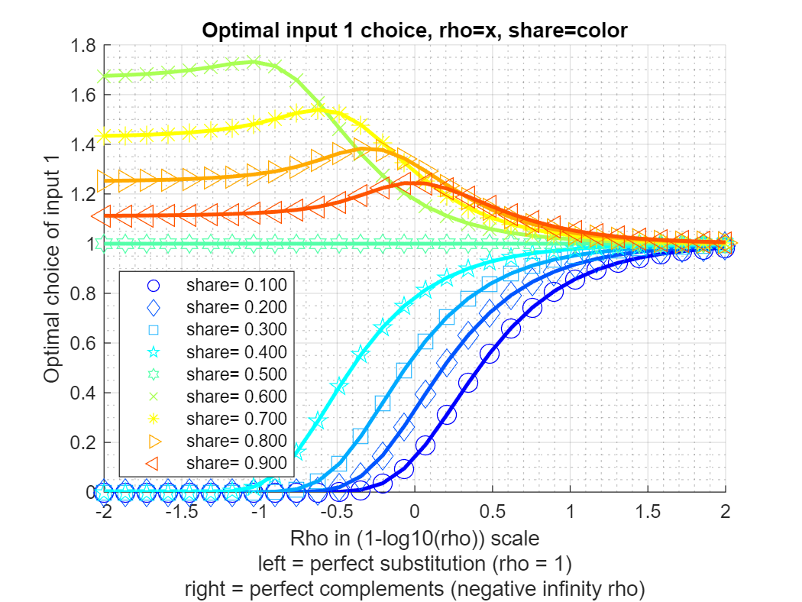

## Solve Nested CES Optimal Demand (CRS)

Testing the
[**bfw_crs_nested_ces**](https://github.com/FanWangEcon/PrjLabEquiBFW/blob/main/PrjLabEquiBFW/solvedemand/bfw_crs_nested_ces.m)
function from the [**PrjLabEquiBFW
Package**](https://fanwangecon.github.io/PrjLabEquiBFW/)**.** This
function solves optimal choices given CES production function under cost
minimization. Works with Constant Elasticity of Substitution problems
with constant returns, up to four nest layers, and two inputs in each
sub-nest. Takes as inputs share and elasticity parameters across layers
of sub-nests, as well as input unit costs at the bottom-most layer.
Works with Constant Elasticity of Substitution problems with constant
returns, up to four nest layers, and two inputs in each sub-nest. Allows
for uneven branches, so that some branches go up to four layers, but
others have less layers, works with BFW (2022) nested labor input
problem.

### Key Inputs and Outputs for [**bfw_mp_func_demand**](https://github.com/FanWangEcon/PrjLabEquiBFW/tree/main/PrjLabEquiBFW/func/bfw_mp_func_demand.m) 

Here are the key inputs for the CES demand solver function:

-   **FL_YZ** float output divided by productivity, aggregate single
    term

-   **CL_MN_PRHO** cell array of rho (elasticity) parameter between
    negative infinity and 1. For example, suppose there are four nest
    layers, and there are two branches at each layer, then we have 1, 2,
    4, and 8 $\rho$ parameter values at the 1st, 2nd, 3rd, and 4th nest
    layers: size(CL_MN_PRHO{1})= $\left\lbrack 1,1\right\rbrack$,
    size(CL_MN_PRHO{2}) = $\left\lbrack 1,2\right\rbrack$,
    size(CL_MN_PRHO{3}) = $\left\lbrack 2,2\right\rbrack$,
    size(CL_MN_PRHO{4}) = $\left\lbrack 2,2,2\right\rbrack$. Note that
    if the model has 4 nest layers, not all cells need to be specified,
    some branches could be deeper than others.

-   **CL_MN_PSHARE** cell array of share (between 0 and 1) for the first
    input of the two inputs for each nest. The structure for this is
    similar to CL_MN_PRHO.

-   **CL_MN_PRICE** cell array of wages for both wages for the first and
    second nest, the last index in each element of the cell array
    indicates first (1) or second (2) wage. For example, suppose we have
    four layers, with 2 branches at each layer, as in the example for
    CL_MN_PRHO, then we have 2, 4, 8, and 16 wage values at the 1st,
    2nd, 3rd, and 4th nest layers: size(CL_MN_PRICE{1}) =
    $\left\lbrack 1,2\right\rbrack$, size(CL_MN_PRICE{2}) =
    $\left\lbrack 2,2\right\rbrack$, size(CL_MN_PRICE{3}) =
    $\left\lbrack 2,2,2\right\rbrack$, size(CL_MN_PRICE{4}) =
    $\left\lbrack 2,2,2,2\right\rbrack$ . Note that only the last layer
    of wage needs to be specified, in this case, the 16 wages at the 4th
    layer. Given optimal solutions, we solve for the 2, 4, and 8
    aggregate wages at the higher nest layers. If some branches are
    deeper than other branches, then can specific NA for non-reached
    layers along some branches.

-   **BL_BFW_MODEL** boolean true by default if true then will output
    outcomes specific to the BFW 2022 problem.

Here are the key outputs for the CES demand solver function:

-   **CL_MN_YZ_CHOICES** has the same dimension as CL_MN_PRICE, suppose
    there are four layers, the CL_MN_PRICE{4} results at the lowest
    layer includes quantity choices that might be observed in the data.
    CL_MN_PRICE cell values at non-bottom layers include aggregate
    quantity outcomes.

-   **CL_MN_PRICE** includes at the lowest layer observed wages,
    however, also includes higher layer aggregate solved waves.
    CL_MN_PRHO and CL_MN_PSHARE are identical to inputs.

### Single Nest Layer Two Inputs CES Problem (Demand)

In this first example, we solve a constant returns to scale problem with
a single nest, meaning just two inputs and a single output.

    clc;
    close all;
    clear all;

    % Output requirement
    fl_yz = 1;
    % rho = 0.5, 1/(1-0.5)=2, elasticity of substitution of 2
    cl_mn_prho = {[0.1]};
    % equal share, similar "productivity"
    cl_mn_pshare = {[0.5]};
    % wages for the two inputs, identical wage
    cl_mn_price = {[1.5, 0.75]};
    % print option
    bl_verbose = true;
    mp_func = bfw_mp_func_demand();
    bl_bfw_model = false;
    [cl_mn_yz_choices, cl_mn_price] = ...
        bfw_crs_nested_ces(fl_yz, cl_mn_prho, cl_mn_pshare, cl_mn_price, ...
        mp_func, bl_verbose, bl_bfw_model);

    ----------------------------------------
    xxxxxxxxxxxxxxxxxxxxxxxxxxxxxxxxxxxxxxxx
    CONTAINER NAME: mp_container_map ND Array (Matrix etc)
    xxxxxxxxxxxxxxxxxxxxxxxxxxxxxxxxxxxxxxxx
                    i    idx    ndim    numel    rowN    colN     sum       mean       std      coefvari      min       max  
                    _    ___    ____    _____    ____    ____    ______    ______    _______    ________    _______    ______

        price_c1    1     2      2        2       1       2        2.25     1.125    0.53033     0.4714        0.75       1.5
        yz_c1       2     4      2        2       1       2      2.1343    1.0671    0.55403    0.51918     0.67537    1.4589

    xxx TABLE:price_c1 xxxxxxxxxxxxxxxxxx
              c1      c2 
              ___    ____

        r1    1.5    0.75

    xxx TABLE:yz_c1 xxxxxxxxxxxxxxxxxx
                c1         c2  
              _______    ______

        r1    0.67537    1.4589

    ----------------------------------------
    xxxxxxxxxxxxxxxxxxxxxxxxxxxxxxxxxxxxxxxx
    CONTAINER NAME: mp_container_map Scalars
    xxxxxxxxxxxxxxxxxxxxxxxxxxxxxxxxxxxxxxxx
                     i    idx    value
                     _    ___    _____

        prho_c1      1     1      0.1 
        pshare_c1    2     3      0.5 

### Single Nest Layer Two Inputs CES Problem, Vary Share and Elasticity (Demand)

In this second example, we test over different rho values, explore
optimal relative choices, as share and elasticity change. In this
exercise, we also check, at every combination of rho and share
parameter, whether the FOC condition is satisfied by the optimal
choices. Also check if at the optimal choices, the minimization output
requirement is met.

    % Approximately close function
    rel_tol=1e-09;
    abs_tol=0.0;
    if_is_close = @(a,b) (abs(a-b) <= max(rel_tol * max(abs(a), abs(b)), abs_tol));

    % Define share and rho arrays
    fl_yz = 1;
    ar_pshare = linspace(0.1, 0.9, 9);
    ar_prho = 1 - 10.^(linspace(-2, 2, 30));
    % Loop over share and rho values
    mt_rela_opti = NaN([length(ar_pshare), length(ar_prho)]);
    mt_x1_opti = NaN([length(ar_pshare), length(ar_prho)]);
    for it_pshare_ctr = 1:length(ar_pshare)
        for it_prho_ctr = 1:length(ar_prho)

            % A. Parameters
            % rho
            fl_prho = ar_prho(it_prho_ctr);
            cl_mn_prho = {[fl_prho]};
            % share
            fl_pshare = ar_pshare(it_pshare_ctr);
            cl_mn_pshare = {[fl_pshare]};
            % wages for the two inputs, identical wage
            cl_mn_price = {[1, 1]};
            % print option
            bl_verbose = false;

            % B. Call function
            [cl_mn_yz_choices, cl_mn_price, cl_mn_prho, cl_mn_pshare] = ...
                bfw_crs_nested_ces(fl_yz, cl_mn_prho, cl_mn_pshare, cl_mn_price, ...
                mp_func, bl_verbose, bl_bfw_model);
            % Store results for optimal choice
            fl_opti_x1 = cl_mn_yz_choices{1}(1);
            fl_opti_x2 = cl_mn_yz_choices{1}(2);
            mt_x1_opti(it_pshare_ctr, it_prho_ctr) = fl_opti_x1;

            % C. Check if relative optimality FOC condition is met
            fl_rela_opti = fl_opti_x1/fl_opti_x2;
            % From FOC give wages = 1 both
            % Using What is above Equation A.20 in draft.
            fl_rela_opti_foc = (((fl_pshare/(1-fl_pshare)))*(1))^(1/(1-ar_prho(it_prho_ctr)));
            if (~if_is_close(fl_rela_opti_foc, fl_rela_opti))
                error('There is an error, optimal relative not equal to expected foc ratio')
            end

            % D. Check if output quantity requirement is met
            fl_output = ((fl_pshare)*fl_opti_x1^(fl_prho) + (1-fl_pshare)*fl_opti_x2^(fl_prho))^(1/fl_prho);
            if (~if_is_close(fl_output, fl_yz))
                error('There is an error, output is not equal to required expenditure minimizing output')
            end

        end
    end

Key results: (1) As share parameter of input 1 goes to zero, optimal
choice goes to zero when inputs are elastic; (2) When inputs are
inelasticty, even very low share input 1 asymptote to equal input 2; (3)
When input 1 is more productive (higher share), actually hire less as
productivity (share) increases, becasue less of it is needed to achieve
production for high rho, elastictic production function; (4) For
inelastic production, monotonic relationship between input and shares.

    % Visualize
    % Generate some Data
    rng(456);
    ar_row_grid = ar_pshare;
    ar_col_grid = log(1-ar_prho)/log(10);
    rng(123);
    mt_value = mt_x1_opti;
    % container map settings
    mp_support_graph = containers.Map('KeyType', 'char', 'ValueType', 'any');
    mp_support_graph('cl_st_graph_title') = {'Optimal input 1 choice, rho=x, share=color'};
    mp_support_graph('cl_st_ytitle') = {'Optimal choice of input 1'};
    mp_support_graph('cl_st_xtitle') = {'Rho in (1-log10(rho)) scale', ...
        'left = perfect substitution (rho = 1)', ...
        'right = perfect complements (negative infinity rho)'};
    mp_support_graph('st_legend_loc') = 'southwest';
    mp_support_graph('bl_graph_logy') = false; % do not log
    mp_support_graph('st_rowvar_name') = 'share=';
    mp_support_graph('it_legend_select') = 5; % how many shock legends to show
    mp_support_graph('st_rounding') = '6.3f'; % format shock legend
    mp_support_graph('cl_colors') = 'jet'; % any predefined matlab colormap
    % Call function
    ff_graph_grid(mt_value, ar_row_grid, ar_col_grid, mp_support_graph);

{width=500px}

### Doubly Nest Layer Two Inputs Each Sub-nest CES Problem (Demand)

In this third example, solve for optimal choices for a doubly nested
problem. Below, we first solve for the optimal choices, then we do a
number of checks, to make sure that the solutions are correct, as
expected.

    % output requirement
    fl_yz = 2.1;
    % upper nest 0.1, lower nests 0.35 and -1 separately for rho values
    cl_mn_prho = {[0.1], [0.35, -1]};
    % unequal shares of share values
    cl_mn_pshare = {[0.4], [0.3, 0.88]};
    % differential wages
    % in lower-left nest, not productive and very expensive, not very elastic
    % last index for left or right,
    cl_mn_price = {[nan, nan], [10, 1;3, 4]};
    % print option
    bl_verbose = true;
    [cl_mn_yz_choices, cl_mn_price, cl_mn_prho, cl_mn_pshare] = ...
        bfw_crs_nested_ces(fl_yz, cl_mn_prho, cl_mn_pshare, cl_mn_price, ...
        mp_func, bl_verbose, bl_bfw_model);

    ----------------------------------------
    xxxxxxxxxxxxxxxxxxxxxxxxxxxxxxxxxxxxxxxx
    CONTAINER NAME: mp_container_map ND Array (Matrix etc)
    xxxxxxxxxxxxxxxxxxxxxxxxxxxxxxxxxxxxxxxx
                     i    idx    ndim    numel    rowN    colN     sum       mean       std      coefvari      min        max  
                     _    ___    ____    _____    ____    ____    ______    ______    _______    ________    ________    ______

        prho_c2      1     2      2        2       1       2       -0.65    -0.325    0.95459    -2.9372           -1      0.35
        price_c1     2     3      2        2       1       2      7.7788    3.8894     2.0959    0.53886       2.4074    5.3714
        price_c2     3     4      2        4       2       2          18       4.5      3.873    0.86066            1        10
        pshare_c2    4     6      2        2       1       2        1.18      0.59    0.41012    0.69512          0.3      0.88
        yz_c1        5     7      2        2       1       2      4.4862    2.2431    0.68863      0.307       1.7561      2.73
        yz_c2        6     8      2        4       2       2      9.0506    2.2626     2.7086     1.1971     0.047893    6.0934

    xxx TABLE:prho_c2 xxxxxxxxxxxxxxxxxx
               c1     c2
              ____    __

        r1    0.35    -1

    xxx TABLE:price_c1 xxxxxxxxxxxxxxxxxx
                c1        c2  
              ______    ______

        r1    2.4074    5.3714

    xxx TABLE:price_c2 xxxxxxxxxxxxxxxxxx
              c1    c2
              __    __

        r1    10    1 
        r2     3    4 

    xxx TABLE:pshare_c2 xxxxxxxxxxxxxxxxxx
              c1      c2 
              ___    ____

        r1    0.3    0.88

    xxx TABLE:yz_c1 xxxxxxxxxxxxxxxxxx
               c1       c2  
              ____    ______

        r1    2.73    1.7561

    xxx TABLE:yz_c2 xxxxxxxxxxxxxxxxxx
                 c1         c2   
              ________    _______

        r1    0.047893     6.0934
        r2      2.2044    0.70496

    ----------------------------------------
    xxxxxxxxxxxxxxxxxxxxxxxxxxxxxxxxxxxxxxxx
    CONTAINER NAME: mp_container_map Scalars
    xxxxxxxxxxxxxxxxxxxxxxxxxxxxxxxxxxxxxxxx
                     i    idx    value
                     _    ___    _____

        prho_c1      1     1      0.1 
        pshare_c1    2     5      0.4 

    % there are four optimal choices, they are
    fl_opti_x11 = cl_mn_yz_choices{2}(1,1);
    fl_opti_x12 = cl_mn_yz_choices{2}(1,2);
    fl_opti_x21 = cl_mn_yz_choices{2}(2,1);
    fl_opti_x22 = cl_mn_yz_choices{2}(2,2);
    % display
    st_print = strjoin(...
        ["completed double nest test:", ...
        ['nest 1 input 1, fl_opti_x11=' num2str(fl_opti_x11)], ...
        ['nest 1 input 2, fl_opti_x12=' num2str(fl_opti_x12)], ...
        ['nest 2 input 1, fl_opti_x21=' num2str(fl_opti_x21)], ...
        ['nest 2 input 2, fl_opti_x22=' num2str(fl_opti_x22)], ...
        ], ";");
    st_out = st_print;
    ar_ch_out = char(strsplit(st_print,";")');
    disp(ar_ch_out);

    completed double nest test:         
    nest 1 input 1, fl_opti_x11=0.047893
    nest 1 input 2, fl_opti_x12=6.0934  
    nest 2 input 1, fl_opti_x21=2.2044  
    nest 2 input 2, fl_opti_x22=0.70496 

### Doubly Nest Layer Two Inputs Each Sub-nest CES Problem--Solution Check (Demand)

Checking output equality, if there are problems, would output an error.

    % A. Check output Equality
    fl_pshare_0 = cl_mn_pshare{1}(1);
    fl_pshare_1 = cl_mn_pshare{2}(1);
    fl_pshare_2 = cl_mn_pshare{2}(2);
    fl_prho_0 = cl_mn_prho{1}(1);
    fl_prho_1 = cl_mn_prho{2}(1);
    fl_prho_2 = cl_mn_prho{2}(2);
    fl_output_1 = ((fl_pshare_1)*fl_opti_x11^(fl_prho_1) + (1-fl_pshare_1)*fl_opti_x12^(fl_prho_1))^(1/fl_prho_1);
    fl_output_2 = ((fl_pshare_2)*fl_opti_x21^(fl_prho_2) + (1-fl_pshare_2)*fl_opti_x22^(fl_prho_2))^(1/fl_prho_2);
    fl_output_0 = ((fl_pshare_0)*fl_output_1^(fl_prho_0) + (1-fl_pshare_0)*fl_output_2^(fl_prho_0))^(1/fl_prho_0);
    if (~if_is_close(fl_output_0, fl_yz))
        error('There is an error, output is not equal to required expenditure minimizing output')
    end

Checking FOC within-nest optimality, if there are problems, would output
an error.

    % B. Check FOC Optimality inner nest
    fl_wage_x11 = cl_mn_price{2}(1,1);
    fl_wage_x12 = cl_mn_price{2}(1,2);
    fl_wage_x21 = cl_mn_price{2}(2,1);
    fl_wage_x22 = cl_mn_price{2}(2,2);

    % B1. Checking via Method 1
    fl_rela_opti_foc_1 = (((fl_pshare_1/(1-fl_pshare_1)))*(fl_wage_x12/fl_wage_x11))^(1/(1-fl_prho_1));
    fl_rela_opti_foc_2 = (((fl_pshare_2/(1-fl_pshare_2)))*(fl_wage_x22/fl_wage_x21))^(1/(1-fl_prho_2));
    if (~if_is_close(fl_rela_opti_foc_1, fl_opti_x11/fl_opti_x12))
        error('B1. There is an error, optimal relative not equal to expected foc ratio, nest 1')
    end
    if (~if_is_close(fl_rela_opti_foc_2, fl_opti_x21/fl_opti_x22))
        error('B1. There is an error, optimal relative not equal to expected foc ratio, nest 2')
    end

    % B2. Equation left to right, right to left, checking via method 2
    % Check FOC Optimality cross nests (actually within) T1
    fl_dy_dx11 = fl_pshare_1*(fl_opti_x11^(fl_prho_1-1));
    fl_dy_dx12 = (1-fl_pshare_1)*(fl_opti_x12^(fl_prho_1-1));
    fl_rwage_x11dx12 = fl_dy_dx11/fl_dy_dx12;
    if (~if_is_close(fl_rwage_x11dx12, fl_wage_x11/fl_wage_x12))
        error('B2. There is an error, relative price x11 and x12 does not satisfy within optimality across nests')
    end

Generate aggregate prices, if there are problems, would output an error.

    % C. Aggregate prices and optimality within higher tier
    % Is optimality satisfied given aggregate prices?
    fl_rela_wage_share_11 = ...
        ((fl_wage_x11/fl_wage_x12)*((1-fl_pshare_1)/(fl_pshare_1)))^(fl_prho_1/(1-fl_prho_1));
    fl_rela_wage_share_12 = ...
        ((fl_wage_x12/fl_wage_x11)*((fl_pshare_1)/(1-fl_pshare_1)))^(fl_prho_1/(1-fl_prho_1));
    fl_agg_prc_1 = ...
        fl_wage_x11*(fl_pshare_1 + (1-fl_pshare_1)*(fl_rela_wage_share_11))^(-1/fl_prho_1) + ...
        fl_wage_x12*(fl_pshare_1*(fl_rela_wage_share_12) + (1-fl_pshare_1))^(-1/fl_prho_1);

    fl_rela_wage_share_21 = ...
        ((fl_wage_x21/fl_wage_x22)*((1-fl_pshare_2)/(fl_pshare_2)))^(fl_prho_2/(1-fl_prho_2));
    fl_rela_wage_share_22 = ...
        ((fl_wage_x22/fl_wage_x21)*((fl_pshare_2)/(1-fl_pshare_2)))^(fl_prho_2/(1-fl_prho_2));
    fl_agg_prc_2 = ...
        fl_wage_x21*(fl_pshare_2 + (1-fl_pshare_2)*(fl_rela_wage_share_21))^(-1/fl_prho_2) + ...
        fl_wage_x22*(fl_pshare_2*(fl_rela_wage_share_22) + (1-fl_pshare_2))^(-1/fl_prho_2);

    % What is returned by the omega function that is suppose to have aggregate prices?
    mp_func = bfw_mp_func_demand();
    params_group = values(mp_func, {'fc_OMEGA', 'fc_d1', 'fc_d2'});
    [fc_OMEGA, fc_d1, fc_d2] = params_group{:};

    % Aggregate price
    fl_aggregate_price_1 = fc_OMEGA(...
        fl_wage_x11, fl_wage_x12, ...
        fl_prho_1, ...
        fl_pshare_1, 1 - fl_pshare_1);

    fl_aggregate_price_2 = fc_OMEGA(...
        fl_wage_x21, fl_wage_x22, ...
        fl_prho_2, ...
        fl_pshare_2, 1 - fl_pshare_2);    

Check relative price within nest and across nests, if there are
problems, would output an error.

    % D. Check FOC Optimality cross nests

    % D1a. Two within-nest relative wages and four cross-nest relative wages
    % within
    fl_rwage_x11dx12 = fl_wage_x11/fl_wage_x12;
    fl_rwage_x21dx22 = fl_wage_x21/fl_wage_x22;
    % across
    fl_rwage_x11dx21 = fl_wage_x11/fl_wage_x21;
    fl_rwage_x11dx22 = fl_wage_x11/fl_wage_x22;
    fl_rwage_x12dx21 = fl_wage_x12/fl_wage_x21;
    fl_rwage_x12dx22 = fl_wage_x12/fl_wage_x22;

    % D1b. Generate relative wages within nest and across nests own equations
    fl_dy_dx1_shared = (fl_pshare_0*(fl_output_1)^(fl_prho_0-1))*((fl_output_1)^(1-fl_prho_1));
    fl_dy_dx11 = fl_dy_dx1_shared*(fl_pshare_1*fl_opti_x11^(fl_prho_1-1));
    fl_dy_dx12 = fl_dy_dx1_shared*((1-fl_pshare_1)*fl_opti_x12^(fl_prho_1-1));

    fl_dy_dx2_shared = ((1-fl_pshare_0)*(fl_output_2)^(fl_prho_0-1))*((fl_output_2)^(1-fl_prho_2));
    fl_dy_dx21 = fl_dy_dx2_shared*(fl_pshare_2*fl_opti_x21^(fl_prho_2-1));
    fl_dy_dx22 = fl_dy_dx2_shared*((1-fl_pshare_2)*fl_opti_x22^(fl_prho_2-1));

    % within
    fl_rwage_x11dx12_foc = fl_dy_dx11/fl_dy_dx12;
    fl_rwage_x21dx22_foc = fl_dy_dx21/fl_dy_dx22;
    % across
    fl_rwage_x11dx21_foc = fl_dy_dx11/fl_dy_dx21;
    fl_rwage_x11dx22_foc = fl_dy_dx11/fl_dy_dx22;
    fl_rwage_x12dx21_foc = fl_dy_dx12/fl_dy_dx21;
    fl_rwage_x12dx22_foc = fl_dy_dx12/fl_dy_dx22;

    if (~if_is_close(fl_rwage_x11dx21_foc, fl_wage_x11/fl_wage_x21))
        error('There is an error, relative price x11 and x21 does not satisfy cross optimality across nests')
    end
    if (~if_is_close(fl_rwage_x12dx22_foc, fl_wage_x12/fl_wage_x22))
        error('There is an error, relative price x12 and x22 does not satisfy cross optimality across nests')
    end

    % D2. Check FOC Optimality cross nests, simplified equation
    fl_rela_wage_x11_x21 = log((fl_pshare_0/(1-fl_pshare_0))* ...
        ((fl_pshare_1*fl_opti_x11^(fl_prho_1-1)*fl_output_2^(fl_prho_2))/(fl_pshare_2*fl_opti_x21^(fl_prho_2-1)*fl_output_1^(fl_prho_1)))) + ...
        fl_prho_0*log(fl_output_1/fl_output_2);
    if (~if_is_close(fl_rela_wage_x11_x21, log(fl_wage_x11/fl_wage_x21)))
        error('There is an error, relative price x11 and x21 does not satisfy cross optimality across nests')
    end

### BFW (2022) Nested Three Branch (Four Layer) Problem (Demand)

The model BFW 2022 has three branches and four layers. one of the
branches go down only three layers, the other two branches go down four
layers.

First, we prepare the various inputs:

    % Controls
    bl_verbose = true;
    bl_bfw_model = true;

    % Given rho and beta, solve for equilibrium quantities
    bl_log_wage = false;
    mp_func = bfw_mp_func_demand(bl_log_wage);

    % Following instructions in: PrjFLFPMexicoBFW\solvedemand\README.md

    % Nests/layers
    it_nests = 4;

    % Input cell of mn matrixes
    it_prho_cl = 1;
    it_pshare_cl = 2;
    it_price_cl = 3;
    for it_cl_ctr = [1,2,3]

        cl_mn_cur = cell(it_nests,1);

        % Fill each cell element with NaN mn array
        for it_cl_mn = 1:it_nests

            bl_price = (it_cl_ctr == it_price_cl);

            if (~bl_price && it_cl_mn == 1)
                mn_nan = NaN;
            elseif (~bl_price && it_cl_mn == 2) || (bl_price && it_cl_mn == 1)
                mn_nan = [NaN, NaN];
            elseif (~bl_price && it_cl_mn == 3) || (bl_price && it_cl_mn == 2)
                mn_nan = NaN(2,2);
            elseif (~bl_price && it_cl_mn == 4) || (bl_price && it_cl_mn == 3)
                mn_nan = NaN(2,2,2);
            elseif (~bl_price && it_cl_mn == 5) || (bl_price && it_cl_mn == 4)
                mn_nan = NaN(2,2,2,2);
            elseif (~bl_price && it_cl_mn == 6) || (bl_price && it_cl_mn == 5)
                mn_nan = NaN(2,2,2,2,2);
            end
            cl_mn_cur{it_cl_mn} = mn_nan;
        end

        % Name cell arrays
        if (it_cl_ctr == it_prho_cl)
            cl_mn_prho = cl_mn_cur;
        elseif (it_cl_ctr == it_pshare_cl)
            cl_mn_pshare = cl_mn_cur;
        elseif (it_cl_ctr == it_price_cl)
            cl_mn_price = cl_mn_cur;
        end
    end

    % Initialize share matrix
    rng(123);
    for it_cl_mn = 1:it_nests
        mn_pshare = cl_mn_pshare{it_cl_mn};
        if it_cl_mn == 4
            mn_pshare(2,:,:) = rand(2,2);
        else
            mn_pshare = rand(size(mn_pshare));
        end
        cl_mn_pshare{it_cl_mn} = mn_pshare;
    end

    % Initialize rho matrix
    rng(456);
    for it_cl_mn = 1:it_nests
        mn_prho = cl_mn_prho{it_cl_mn};
        if it_cl_mn == 4
            mn_prho(2,:,:) = rand(2,2);
        else
            mn_prho = rand(size(mn_prho));
        end
        % Scalling rho between 0.7500 and -3.0000
        % 1 - 2.^(linspace(-2,2,5))
        mn_prho = 1 - 2.^(mn_prho*(4) - 2);
        cl_mn_prho{it_cl_mn} = mn_prho;
    end

    % Initialize wage matrix
    rng(789);
    for it_cl_mn = 1:it_nests
        mn_price = cl_mn_price{it_cl_mn};
        if it_cl_mn == 3
            mn_price(1,:,:) = rand(2,2);
        elseif it_cl_mn == 4
            mn_price(2,:,:,:) = rand(2,2,2);
        end
        % Scalling rho between 3 amd 5
        mn_price = mn_price*(2) + 3;
        cl_mn_price{it_cl_mn} = mn_price;
    end

    % Initialize yz matrix
    rng(101112);
    fl_yz = rand();

Second, display created inputs:

    disp(['fl_yz=' num2str(fl_yz)]);

    fl_yz=0.89726

    celldisp(cl_mn_prho);

    cl_mn_prho
     
    cl_mn_prho{1} =
     
        0.5017

     
     
    cl_mn_prho{2} =
     
        0.6071   -1.1955

     
     
    cl_mn_prho{3} =
     
       -1.3523   -0.3346
       -0.4167   -1.9136

     
     
    cl_mn_prho{4} =
     

    (:,:,1) =

           NaN       NaN
       -1.0512    0.5869

    (:,:,2) =

           NaN       NaN
        0.6209    0.1633

     

    celldisp(cl_mn_pshare);

    cl_mn_pshare
     
    cl_mn_pshare{1} =
     
        0.6965

     
     
    cl_mn_pshare{2} =
     
        0.2861    0.2269

     
     
    cl_mn_pshare{3} =
     
        0.5513    0.4231
        0.7195    0.9808

     
     
    cl_mn_pshare{4} =
     

    (:,:,1) =

           NaN       NaN
        0.6848    0.4809

    (:,:,2) =

           NaN       NaN
        0.3921    0.3432

     

    celldisp(cl_mn_price);

    cl_mn_price
     
    cl_mn_price{1} =
     
       NaN   NaN

     
     
    cl_mn_price{2} =
     
       NaN   NaN
       NaN   NaN

     
     
    cl_mn_price{3} =
     

    (:,:,1) =

        3.6467    3.4605
           NaN       NaN

    (:,:,2) =

        4.5876    4.2488
           NaN       NaN

     
     
    cl_mn_price{4} =
     

    (:,:,1,1) =

           NaN       NaN
        4.9508    4.5178

    (:,:,2,1) =

           NaN       NaN
        3.0212    3.0495

    (:,:,1,2) =

           NaN       NaN
        3.2221    4.0763

    (:,:,2,2) =

           NaN       NaN
        3.0909    4.1031

     

Third, call function and solve for optimal demand:

    % Call function
    [cl_mn_yz_choices, cl_mn_price, cl_mn_prho, cl_mn_pshare] = ...
        bfw_crs_nested_ces(fl_yz, cl_mn_prho, cl_mn_pshare, cl_mn_price, ...
        mp_func, bl_verbose, bl_bfw_model);

    ----------------------------------------
    xxxxxxxxxxxxxxxxxxxxxxxxxxxxxxxxxxxxxxxx
    CONTAINER NAME: mp_container_map ND Array (Matrix etc)
    xxxxxxxxxxxxxxxxxxxxxxxxxxxxxxxxxxxxxxxx
                                i     idx    ndim    numel    rowN    colN      sum         mean        std       coefvari      min         max   
                                __    ___    ____    _____    ____    ____    ________    ________    ________    ________    ________    ________

        mt_fl_labor_demanded     1     1      2       12       4       3        5.4455     0.45379     0.85359       1.881    0.020122      2.3642
        prho_c2                  2     3      2        2       1       2      -0.58844    -0.29422      1.2746     -4.3323     -1.1955     0.60709
        prho_c3                  3     4      2        4       2       2       -4.0173     -1.0043     0.76195    -0.75868     -1.9136    -0.33464
        prho_c4                  4     5      3        8       2       4           NaN         NaN         NaN         NaN     -1.0512     0.62089
        price_c1                 5     6      2        2       1       2        35.345      17.673      7.0394     0.39832      12.695       22.65
        price_c2                 6     7      2        4       2       2        40.906      10.226      2.7834     0.27217      7.7015      13.522
        price_c3                 7     8      3        8       2       4        45.403      5.6754      2.0037     0.35305      3.4605      8.5114
        price_c4                 8     9      4       16       2       8           NaN         NaN         NaN         NaN      3.0212      4.9508
        pshare_c2                9    11      2        2       1       2       0.51299      0.2565    0.041923     0.16344     0.22685     0.28614
        pshare_c3               10    12      2        4       2       2        2.6747     0.66866     0.24087     0.36023     0.42311     0.98076
        pshare_c4               11    13      3        8       2       4           NaN         NaN         NaN         NaN     0.34318     0.68483
        yz_c1                   12    14      2        2       1       2        1.6003     0.80016      1.0053      1.2564    0.089284       1.511
        yz_c2                   13    15      2        4       2       2         2.645     0.66124      1.0849      1.6407    0.057461      2.2864
        yz_c3                   14    16      3        8       2       4        5.1962     0.64953      1.0063      1.5492     0.03298      2.3642
        yz_c4                   15    17      4       16       2       8           NaN         NaN         NaN         NaN    0.020122     0.14469

    xxx TABLE:mt_fl_labor_demanded xxxxxxxxxxxxxxxxxx
                 c1          c2         c3   
              ________    ________    _______

        r1    0.020122    0.024929     2.1857
        r2    0.060227    0.037985     2.3642
        r3    0.069088    0.093774    0.21107
        r4    0.058349     0.14469    0.17539

    xxx TABLE:prho_c2 xxxxxxxxxxxxxxxxxx
                c1         c2   
              _______    _______

        r1    0.60709    -1.1955

    xxx TABLE:prho_c3 xxxxxxxxxxxxxxxxxx
                 c1          c2   
              ________    ________

        r1     -1.3523    -0.33464
        r2    -0.41668     -1.9136

    xxx TABLE:prho_c4 xxxxxxxxxxxxxxxxxx
                c1         c2         c3         c4   
              _______    _______    _______    _______

        r1        NaN        NaN        NaN        NaN
        r2    -1.0512    0.58694    0.62089    0.16334

    xxx TABLE:price_c1 xxxxxxxxxxxxxxxxxx
                c1       c2  
              ______    _____

        r1    12.695    22.65

    xxx TABLE:price_c2 xxxxxxxxxxxxxxxxxx
                c1        c2  
              ______    ______

        r1    8.1518    7.7015
        r2    13.522     11.53

    xxx TABLE:price_c3 xxxxxxxxxxxxxxxxxx
                c1        c2        c3        c4  
              ______    ______    ______    ______

        r1    3.6467    3.4605    4.5876    4.2488
        r2    8.1184    8.5114    5.7986    7.0309

    xxx TABLE:price_c4 xxxxxxxxxxxxxxxxxx
                c1        c2        c3        c4        c5        c6        c7        c8  
              ______    ______    ______    ______    ______    ______    ______    ______

        r1       NaN       NaN       NaN       NaN       NaN       NaN       NaN       NaN
        r2    4.9508    4.5178    3.0212    3.0495    3.2221    4.0763    3.0909    4.1031

    xxx TABLE:pshare_c2 xxxxxxxxxxxxxxxxxx
                c1         c2   
              _______    _______

        r1    0.28614    0.22685

    xxx TABLE:pshare_c3 xxxxxxxxxxxxxxxxxx
                c1         c2   
              _______    _______

        r1    0.55131    0.42311
        r2    0.71947    0.98076

    xxx TABLE:pshare_c4 xxxxxxxxxxxxxxxxxx
                c1         c2         c3         c4   
              _______    _______    _______    _______

        r1        NaN        NaN        NaN        NaN
        r2    0.68483    0.48093    0.39212    0.34318

    xxx TABLE:yz_c1 xxxxxxxxxxxxxxxxxx
               c1         c2   
              _____    ________

        r1    1.511    0.089284

    xxx TABLE:yz_c2 xxxxxxxxxxxxxxxxxx
                 c1         c2  
              ________    ______

        r1     0.19312    2.2864
        r2    0.057461     0.108

    xxx TABLE:yz_c3 xxxxxxxxxxxxxxxxxx
                c1         c2          c3         c4   
              _______    _______    ________    _______

        r1    0.21107     2.1857     0.17539     2.3642
        r2    0.06529    0.11907    0.042587    0.03298

    xxx TABLE:yz_c4 xxxxxxxxxxxxxxxxxx
                 c1          c2          c3          c4          c5         c6          c7          c8   
              ________    ________    ________    ________    ________    _______    ________    ________

        r1         NaN         NaN         NaN         NaN         NaN        NaN         NaN         NaN
        r2    0.069088    0.093774    0.020122    0.024929    0.058349    0.14469    0.060227    0.037985

    ----------------------------------------
    xxxxxxxxxxxxxxxxxxxxxxxxxxxxxxxxxxxxxxxx
    CONTAINER NAME: mp_container_map Scalars
    xxxxxxxxxxxxxxxxxxxxxxxxxxxxxxxxxxxxxxxx
                     i    idx     value 
                     _    ___    _______

        prho_c1      1     2     0.50172
        pshare_c1    2    10     0.69647
