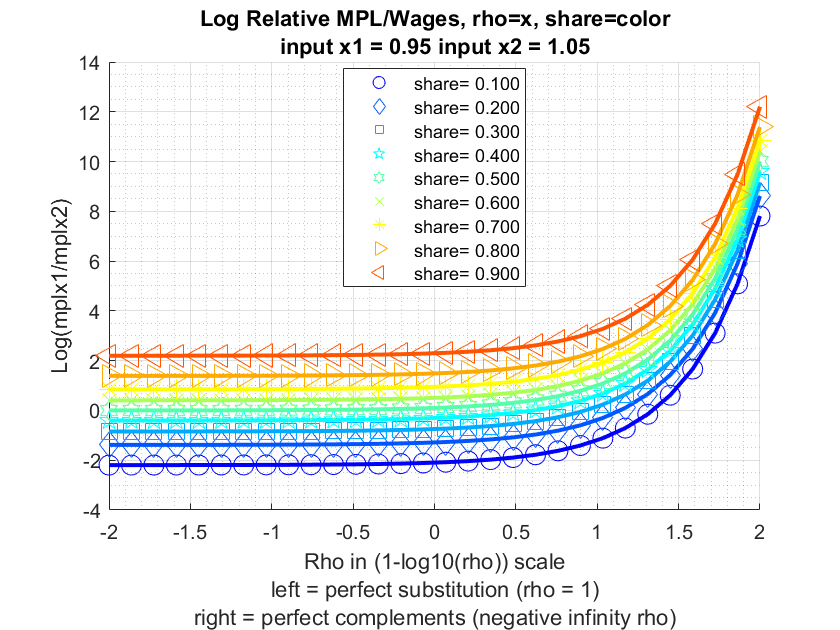

## Compute Nested CES MPL Given Demand (CRS)

Testing the
[**bfw_crs_nested_ces_mpl**](https://github.com/FanWangEcon/PrjLabEquiBFW/blob/main/PrjLabEquiBFW/solvedemand/bfw_crs_nested_ces_mpl.m)
function from the [**PrjLabEquiBFW
Package**](https://fanwangecon.github.io/PrjLabEquiBFW/)**.** Given
labor quantity demanded, using first-order relative optimality
conditions, find the marginal product of labor given CES production
function. Results match up with correct relative wages, but not wage
levels. Takes as inputs share and elasticity parameters across layers of
sub-nests, as well as quantity demanded at each bottom-most CES nest
layer. Works with Constant Elasticity of Substitution problems with
constant returns, up to four nest layers, and two inputs in each
sub-nest. Allows for uneven branches, so that some branches go up to
four layers, but others have less layers, works with BFW (2022) nested
labor input problem.

### Key Inputs and Outputs for [**bfw_crs_nested_ces_mpl**](https://github.com/FanWangEcon/PrjLabEquiBFW/blob/main/PrjLabEquiBFW/solvedemand/bfw_crs_nested_ces_mpl.m)

Here are the key inputs for the CES demand solver function:

-   **CL_MN_PRHO** cell array of rho (elasticity) parameter between
    negative infinity and 1. For example, suppose there are four nest
    layers, and there are two branches at each layer, then we have 1, 2,
    4, and 8 $\rho$ parameter values at the 1st, 2nd, 3rd, and 4th nest
    layers: size(CL_MN_PRHO{1})= $\left\lbrack 1,1\right\rbrack$,
    size(CL_MN_PRHO{2}) = $\left\lbrack 1,2\right\rbrack$,
    size(CL_MN_PRHO{3}) = $\left\lbrack 2,2\right\rbrack$,
    size(CL_MN_PRHO{4}) = $\left\lbrack 2,2,2\right\rbrack$. Note that
    if the model has 4 nest layers, not all cells need to be specified,
    some branches could be deeper than others.

-   **CL_MN_PSHARE** cell array of share (between 0 and 1) for the first
    input of the two inputs for each nest. The structure for this is
    similar to CL_MN_PRHO.

-   **CL_MN_YZ_CHOICES** cell array of quantity demanded for the first
    and second inputs of the bottom-most layer of sub-nests. The last
    index in each element of the cell array indicates first (1) or
    second (2) quantities. For example, suppose we have four layers,
    with 2 branches at each layer, as in the example for CL_MN_PRHO,
    then we have 2, 4, 8, and 16 quantity values at the 1st, 2nd, 3rd,
    and 4th nest layers: size(CL_MN_YZ_CHOICES{1})=
    $\left\lbrack 1,2\right\rbrack$, size(CL_MN_YZ_CHOICES{2})=
    $\left\lbrack 2,2\right\rbrack$, size(CL_MN_YZ_CHOICES{3})=
    $\left\lbrack 2,2,2\right\rbrack$, size(CL_MN_YZ_CHOICES{4})=
    $\left\lbrack 2,2,2,2\right\rbrack$. Note that only the last layer
    of quantities needs to be specified, in this case, the 16 quantities
    at the 4th layer. Given first order conditions, we solve for the 2,
    4, and 8 aggregate quantities at the higher nest layers. If some
    branches are deeper than other branches, then can specific NA for
    non-reached layers along some branches.

-   **BL_BFW_MODEL** boolean true by default if true then will output
    outcomes specific to the BFW 2022 problem.

Here are the key outputs for the CES demand solver function:

-   **CL_MN_MPL_PRICE** has the same dimension as CL_MN_YZ_CHOICES,
    suppose there are four layers, the CL_MN_MPL_PRICE{4} results at the
    lowest layer includes wages that might be observed in the data.
    CL_MN_MPL_PRICE cell values at non-bottom layers include aggregate
    wages.

-   **CL_MN_YZ_CHOICES** includes at the lowest layer observed wages,
    however, also includes higher layer aggregate solved quantities.
    CL_MN_PRHO and CL_MN_PSHARE are identical to inputs.

### Single Nest Layer Two Inputs CES Problem (MPL)

In this first example, we solve a constant returns to scale problem with
a single nest, meaning just two inputs and a single output.

    clc;
    close all;
    clear all;

    % rho = 0.5, 1/(1-0.5)=2, elasticity of substitution of 2
    cl_mn_prho = {[0.1]};
    % equal share, similar "productivity"
    cl_mn_pshare = {[0.5]};
    % levels of the two inputs, Values picked from demand problem parallel
    % example.
    cl_mn_yz_choices = {[0.67537, 1.4589]};
    % print option
    bl_verbose = true;
    mp_func = bfw_mp_func_demand();
    bl_bfw_model = false;
    [cl_mn_yz_choices, cl_mn_mpl_price] = ...
        bfw_crs_nested_ces_mpl(cl_mn_prho, cl_mn_pshare, cl_mn_yz_choices, ...
        mp_func, bl_verbose, bl_bfw_model);

    ----------------------------------------
    xxxxxxxxxxxxxxxxxxxxxxxxxxxxxxxxxxxxxxxx
    CONTAINER NAME: mp_container_map ND Array (Matrix etc)
    xxxxxxxxxxxxxxxxxxxxxxxxxxxxxxxxxxxxxxxx
                        i    idx    ndim    numel    rowN    colN     sum       mean        std      coefvari      min        max  
                        _    ___    ____    _____    ____    ____    ______    _______    _______    ________    _______    _______

        mpl_price_c1    1     1      2        2       1       2      1.0678    0.53388    0.25168    0.47141     0.35592    0.71184
        yz_c1           2     4      2        2       1       2      2.1343     1.0671    0.55404    0.51918     0.67537     1.4589

    xxx TABLE:mpl_price_c1 xxxxxxxxxxxxxxxxxx
                c1         c2   
              _______    _______

        r1    0.71184    0.35592

    xxx TABLE:yz_c1 xxxxxxxxxxxxxxxxxx
                c1         c2  
              _______    ______

        r1    0.67537    1.4589

    ----------------------------------------
    xxxxxxxxxxxxxxxxxxxxxxxxxxxxxxxxxxxxxxxx
    CONTAINER NAME: mp_container_map Scalars
    xxxxxxxxxxxxxxxxxxxxxxxxxxxxxxxxxxxxxxxx
                     i    idx    value
                     _    ___    _____

        prho_c1      1     2      0.1 
        pshare_c1    2     3      0.5 

### Single Nest Layer Two Inputs CES Problem, Vary Share and Elasticity (MPL)

In this second example, we test over different rho values, explore
optimal relative choices, as share and elasticity change. In this
exercise, we also check, at every combination of rho and share
parameter, whether the FOC condition is satisfied by the optimal
choices. Also check if at the optimal choices, the minimization output
requirement is met.

    % Approximately close function
    rel_tol=1e-09;
    abs_tol=0.0;
    if_is_close = @(a,b) (abs(a-b) <= max(rel_tol * max(abs(a), abs(b)), abs_tol));

    % Input 1 and 2 fixed
    fl_x_1 = 0.95;
    fl_x_2 = 1.05;

    % Define share and rho arrays
    ar_pshare = linspace(0.1, 0.9, 9);
    ar_prho = 1 - 10.^(linspace(-2, 2, 30));
    % Loop over share and rho values
    mt_rela_opti = NaN([length(ar_pshare), length(ar_prho)]);
    mt_rela_wage = NaN([length(ar_pshare), length(ar_prho)]);
    for it_pshare_ctr = 1:length(ar_pshare)
        for it_prho_ctr = 1:length(ar_prho)

            % A. Parameters
            % rho
            fl_prho = ar_prho(it_prho_ctr);
            cl_mn_prho = {[fl_prho]};
            % share
            fl_pshare = ar_pshare(it_pshare_ctr);
            cl_mn_pshare = {[fl_pshare]};
            % wages for the two inputs, identical wage
            % Note that if chosee {[1,1]} below, log(1/1) = log(1) = 0,
            % elasticity does not matter. 
            cl_mn_yz_choices = {[fl_x_1, fl_x_2]};
            % print option
            bl_verbose = false;

            % B. Call function
            [cl_mn_yz_choices, cl_mn_mpl_price] = ...
                bfw_crs_nested_ces_mpl(cl_mn_prho, cl_mn_pshare, cl_mn_yz_choices, ...
                mp_func, bl_verbose, bl_bfw_model);
            % Store results for mpl given input choices
            fl_mpl_x1 = cl_mn_mpl_price{1}(1);
            fl_mpl_x2 = cl_mn_mpl_price{1}(2);
            mt_rela_wage(it_pshare_ctr, it_prho_ctr) = log(fl_mpl_x1/fl_mpl_x2);
        end
    end

Key results: (1) As share parameter of input 1 goes to zero, input 1 is
less productive, and the log(mplx1/mplx2) ratio is lower. (2) Becaus x2
input in this example is larger than x1 input, so as two inputs become
more inelastic (more leontief), relative MPL for the lower level input
is now larger. At the Leontief extreme, the MPL of the input provided at
lower level is infinity.

    % Visualize
    % Generate some Data
    rng(456);
    ar_row_grid = ar_pshare;
    ar_col_grid = log(1-ar_prho)/log(10);
    rng(123);
    mt_value = mt_rela_wage;
    % container map settings
    mp_support_graph = containers.Map('KeyType', 'char', 'ValueType', 'any');
    mp_support_graph('cl_st_graph_title') = {...
        ['Log Relative MPL/Wages, rho=x, share=color'] ...
        ['input x1 = ' num2str(fl_x_1) ' input x2 = ' num2str(fl_x_2)]
        };
    mp_support_graph('cl_st_ytitle') = {'Log(mplx1/mplx2)'};
    mp_support_graph('cl_st_xtitle') = {'Rho in (1-log10(rho)) scale', ...
        'left = perfect substitution (rho = 1)', ...
        'right = perfect complements (negative infinity rho)'};
    mp_support_graph('st_legend_loc') = 'best';
    mp_support_graph('bl_graph_logy') = false; % do not log
    mp_support_graph('st_rowvar_name') = 'share=';
    mp_support_graph('it_legend_select') = 5; % how many shock legends to show
    mp_support_graph('st_rounding') = '6.3f'; % format shock legend
    mp_support_graph('cl_colors') = 'jet'; % any predefined matlab colormap
    % Call function
    ff_graph_grid(mt_value, ar_row_grid, ar_col_grid, mp_support_graph);

{width=500px}

### Doubly Nest Layer Two Inputs Each Sub-nest CES Problem

In this third example, solve for optimal choices for a doubly nested
problem. Below, we first solve for the optimal choices, then we do a
number of checks, to make sure that the solutions are correct, as
expected.

    % output requirement
    fl_yz = 2.1;
    % upper nest 0.1, lower nests 0.35 and -1 separately for rho values
    cl_mn_prho = {[0.1], [0.35, -1]};
    % unequal shares of share values
    cl_mn_pshare = {[0.4], [0.3, 0.88]};
    % differential wages
    % in lower-left nest, not productive and very expensive, not very elastic
    % last index for left or right. Values picked from demand problem parallel
    % example.
    cl_mn_yz_choices = {[nan, nan], [0.04789, 6.0934; 2.2044, 0.70496]};
    % print option
    bl_verbose = true;
    [cl_mn_yz_choices, cl_mn_mpl_price] = ...
        bfw_crs_nested_ces_mpl(cl_mn_prho, cl_mn_pshare, cl_mn_yz_choices, ...
        mp_func, bl_verbose, bl_bfw_model);

    ----------------------------------------
    xxxxxxxxxxxxxxxxxxxxxxxxxxxxxxxxxxxxxxxx
    CONTAINER NAME: mp_container_map ND Array (Matrix etc)
    xxxxxxxxxxxxxxxxxxxxxxxxxxxxxxxxxxxxxxxx
                        i    idx    ndim    numel    rowN    colN     sum       mean        std      coefvari      min        max  
                        _    ___    ____    _____    ____    ____    ______    _______    _______    ________    _______    _______

        mpl_price_c1    1     1      2        2       1       2      1.0206    0.51032    0.27499    0.53886     0.31587    0.70476
        mpl_price_c2    2     2      2        4       2       2      2.3618    0.59045     0.5082    0.86069     0.13121     1.3121
        prho_c2         3     4      2        2       1       2       -0.65     -0.325    0.95459    -2.9372          -1       0.35
        pshare_c2       4     6      2        2       1       2        1.18       0.59    0.41012    0.69512         0.3       0.88
        yz_c1           5     7      2        2       1       2      4.4862     2.2431    0.68863      0.307      1.7562       2.73
        yz_c2           6     8      2        4       2       2      9.0507     2.2627     2.7086     1.1971     0.04789     6.0934

    xxx TABLE:mpl_price_c1 xxxxxxxxxxxxxxxxxx
                c1         c2   
              _______    _______

        r1    0.31587    0.70476

    xxx TABLE:mpl_price_c2 xxxxxxxxxxxxxxxxxx
                c1         c2   
              _______    _______

        r1     1.3121    0.13121
        r2    0.39362    0.52484

    xxx TABLE:prho_c2 xxxxxxxxxxxxxxxxxx
               c1     c2
              ____    __

        r1    0.35    -1

    xxx TABLE:pshare_c2 xxxxxxxxxxxxxxxxxx
              c1      c2 
              ___    ____

        r1    0.3    0.88

    xxx TABLE:yz_c1 xxxxxxxxxxxxxxxxxx
               c1       c2  
              ____    ______

        r1    2.73    1.7562

    xxx TABLE:yz_c2 xxxxxxxxxxxxxxxxxx
                c1         c2   
              _______    _______

        r1    0.04789     6.0934
        r2     2.2044    0.70496

    ----------------------------------------
    xxxxxxxxxxxxxxxxxxxxxxxxxxxxxxxxxxxxxxxx
    CONTAINER NAME: mp_container_map Scalars
    xxxxxxxxxxxxxxxxxxxxxxxxxxxxxxxxxxxxxxxx
                     i    idx    value
                     _    ___    _____

        prho_c1      1     3      0.1 
        pshare_c1    2     5      0.4 

    % there are four optimal choices, they are
    fl_mpl_x11 = cl_mn_mpl_price{2}(1,1);
    fl_mpl_x12 = cl_mn_mpl_price{2}(1,2);
    fl_mpl_x21 = cl_mn_mpl_price{2}(2,1);
    fl_mpl_x22 = cl_mn_mpl_price{2}(2,2);
    % display
    st_print = strjoin(...
        ["completed double nest test:", ...
        ['nest 1 input 1, fl_mpl_x11=' num2str(fl_mpl_x11)], ...
        ['nest 1 input 2, fl_mpl_x12=' num2str(fl_mpl_x12)], ...
        ['nest 2 input 1, fl_mpl_x21=' num2str(fl_mpl_x21)], ...
        ['nest 2 input 2, fl_mpl_x22=' num2str(fl_mpl_x22)], ...
        ['nest 1 input 1, fl_mpl_x11/fl_mpl_x11=' num2str(fl_mpl_x11/fl_mpl_x11)], ...
        ['nest 1 input 2, fl_mpl_x12/fl_mpl_x11=' num2str(fl_mpl_x12/fl_mpl_x11)], ...
        ['nest 2 input 1, fl_mpl_x21/fl_mpl_x11=' num2str(fl_mpl_x21/fl_mpl_x11)], ...
        ['nest 2 input 2, fl_mpl_x22/fl_mpl_x11=' num2str(fl_mpl_x22/fl_mpl_x11)], ...    
        ], ";");
    st_out = st_print;
    ar_ch_out = char(strsplit(st_print,";")');
    disp(ar_ch_out);

    completed double nest test:                   
    nest 1 input 1, fl_mpl_x11=1.3121             
    nest 1 input 2, fl_mpl_x12=0.13121            
    nest 2 input 1, fl_mpl_x21=0.39362            
    nest 2 input 2, fl_mpl_x22=0.52484            
    nest 1 input 1, fl_mpl_x11/fl_mpl_x11=1       
    nest 1 input 2, fl_mpl_x12/fl_mpl_x11=0.099995
    nest 2 input 1, fl_mpl_x21/fl_mpl_x11=0.29998 
    nest 2 input 2, fl_mpl_x22/fl_mpl_x11=0.39999 

### BFW (2022) Nested Three Branch (Four Layer) Problem (MPL)

The model BFW 2022 has three branches and four layers. one of the
branches go down only three layers, the other two branches go down four
layers.

First, we prepare the various inputs:

    % Controls
    bl_verbose = true;
    bl_bfw_model = true;

    % Given rho and beta, solve for equilibrium quantities
    mp_func = bfw_mp_func_demand();

    % Following instructions in: PrjFLFPMexicoBFW\solvedemand\README.md

    % Nests/layers
    it_nests = 4;

    % Input cell of mn matrixes
    it_prho_cl = 1;
    it_pshare_cl = 2;
    it_yz_share_cl = 3;
    for it_cl_ctr = [1,2,3]

        cl_mn_cur = cell(it_nests,1);

        % Fill each cell element with NaN mn array
        for it_cl_mn = 1:it_nests

            bl_yz_share = (it_cl_ctr == it_yz_share_cl);

            if (~bl_yz_share && it_cl_mn == 1)
                mn_nan = NaN;
            elseif (~bl_yz_share && it_cl_mn == 2) || (bl_yz_share && it_cl_mn == 1)
                mn_nan = [NaN, NaN];
            elseif (~bl_yz_share && it_cl_mn == 3) || (bl_yz_share && it_cl_mn == 2)
                mn_nan = NaN(2,2);
            elseif (~bl_yz_share && it_cl_mn == 4) || (bl_yz_share && it_cl_mn == 3)
                mn_nan = NaN(2,2,2);
            elseif (~bl_yz_share && it_cl_mn == 5) || (bl_yz_share && it_cl_mn == 4)
                mn_nan = NaN(2,2,2,2);
            elseif (~bl_yz_share && it_cl_mn == 6) || (bl_yz_share && it_cl_mn == 5)
                mn_nan = NaN(2,2,2,2,2);
            end
            cl_mn_cur{it_cl_mn} = mn_nan;
        end

        % Name cell arrays
        if (it_cl_ctr == it_prho_cl)
            cl_mn_prho = cl_mn_cur;
        elseif (it_cl_ctr == it_pshare_cl)
            cl_mn_pshare = cl_mn_cur;
        elseif (it_cl_ctr == it_yz_share_cl)
            cl_mn_yz_choices = cl_mn_cur;
        end
    end

    % Initialize share matrix
    rng(123);
    for it_cl_mn = 1:it_nests
        mn_pshare = cl_mn_pshare{it_cl_mn};
        if it_cl_mn == 4
            mn_pshare(2,:,:) = rand(2,2);
        else
            mn_pshare = rand(size(mn_pshare));
        end
        cl_mn_pshare{it_cl_mn} = mn_pshare;
    end

    % Initialize rho matrix
    rng(456);
    for it_cl_mn = 1:it_nests
        mn_prho = cl_mn_prho{it_cl_mn};
        if it_cl_mn == 4
            mn_prho(2,:,:) = rand(2,2);
        else
            mn_prho = rand(size(mn_prho));
        end
        % Scalling rho between 0.7500 and -3.0000
        % 1 - 2.^(linspace(-2,2,5))
        mn_prho = 1 - 2.^(mn_prho*(4) - 2);
        cl_mn_prho{it_cl_mn} = mn_prho;
    end

    % Initialize quantities matrix
    rng(789);
    for it_cl_mn = 1:it_nests
        mn_yz_choices = cl_mn_yz_choices{it_cl_mn};
        if it_cl_mn == 3
            mn_yz_choices(1,:,:) = rand(2,2);
        elseif it_cl_mn == 4
            mn_yz_choices(2,:,:,:) = rand(2,2,2);
        end
        % Scalling quantities between 3 amd 5
        mn_yz_choices = mn_yz_choices*(2) + 3;
        cl_mn_yz_choices{it_cl_mn} = mn_yz_choices;
    end

    % Initialize yz matrix
    rng(101112);

Second, display created inputs:

    celldisp(cl_mn_prho);

     
    cl_mn_prho{1} =
     
        0.5017

     
     
    cl_mn_prho{2} =
     
        0.6071   -1.1955

     
     
    cl_mn_prho{3} =
     
       -1.3523   -0.3346
       -0.4167   -1.9136

     
     
    cl_mn_prho{4} =
     

    (:,:,1) =

           NaN       NaN
       -1.0512    0.5869

    (:,:,2) =

           NaN       NaN
        0.6209    0.1633

     

    celldisp(cl_mn_pshare);

     
    cl_mn_pshare{1} =
     
        0.6965

     
     
    cl_mn_pshare{2} =
     
        0.2861    0.2269

     
     
    cl_mn_pshare{3} =
     
        0.5513    0.4231
        0.7195    0.9808

     
     
    cl_mn_pshare{4} =
     

    (:,:,1) =

           NaN       NaN
        0.6848    0.4809

    (:,:,2) =

           NaN       NaN
        0.3921    0.3432

     

    celldisp(cl_mn_yz_choices);

     
    cl_mn_yz_choices{1} =
     
       NaN   NaN

     
     
    cl_mn_yz_choices{2} =
     
       NaN   NaN
       NaN   NaN

     
     
    cl_mn_yz_choices{3} =
     

    (:,:,1) =

        3.6467    3.4605
           NaN       NaN

    (:,:,2) =

        4.5876    4.2488
           NaN       NaN

     
     
    cl_mn_yz_choices{4} =
     

    (:,:,1,1) =

           NaN       NaN
        4.9508    4.5178

    (:,:,2,1) =

           NaN       NaN
        3.0212    3.0495

    (:,:,1,2) =

           NaN       NaN
        3.2221    4.0763

    (:,:,2,2) =

           NaN       NaN
        3.0909    4.1031

     

Third, call function and solve for optimal demand:

    % Call function
    [cl_mn_yz_choices, cl_mn_mpl_price] = ...
        bfw_crs_nested_ces_mpl(cl_mn_prho, cl_mn_pshare, cl_mn_yz_choices, ...
        mp_func, bl_verbose, bl_bfw_model);

    ----------------------------------------
    xxxxxxxxxxxxxxxxxxxxxxxxxxxxxxxxxxxxxxxx
    CONTAINER NAME: mp_container_map ND Array (Matrix etc)
    xxxxxxxxxxxxxxxxxxxxxxxxxxxxxxxxxxxxxxxx
                        i     idx    ndim    numel    rowN    colN      sum         mean        std       coefvari       min         max   
                        __    ___    ____    _____    ____    ____    ________    ________    ________    ________    _________    ________

        mpl_price_c1     1     1      2        2       1       2        1.0002      0.5001     0.28686     0.57362      0.29725     0.70294
        mpl_price_c2     2     2      2        4       2       2        1.0009     0.25022     0.17949     0.71731     0.080381     0.50351
        mpl_price_c3     3     3      3        8       2       4        1.0088      0.1261     0.10191     0.80822    0.0063057     0.25809
        mpl_price_c4     4     4      4       16       2       8           NaN         NaN         NaN         NaN    0.0025507     0.11203
        prho_c2          5     6      2        2       1       2      -0.58844    -0.29422      1.2746     -4.3323      -1.1955     0.60709
        prho_c3          6     7      2        4       2       2       -4.0173     -1.0043     0.76195    -0.75868      -1.9136    -0.33464
        prho_c4          7     8      3        8       2       4           NaN         NaN         NaN         NaN      -1.0512     0.62089
        pshare_c2        8    10      2        2       1       2       0.51299      0.2565    0.041923     0.16344      0.22685     0.28614
        pshare_c3        9    11      2        4       2       2        2.6747     0.66866     0.24087     0.36023      0.42311     0.98076
        pshare_c4       10    12      3        8       2       4           NaN         NaN         NaN         NaN      0.34318     0.68483
        yz_c1           11    13      2        2       1       2        8.0897      4.0448       0.173     0.04277       3.9225      4.1672
        yz_c2           12    14      2        4       2       2        16.015      4.0039     0.19166     0.04787       3.8468      4.2727
        yz_c3           13    15      3        8       2       4        31.235      3.9044     0.51337     0.13149       3.0635      4.5876
        yz_c4           14    16      4       16       2       8           NaN         NaN         NaN         NaN       3.0212      4.9508

    xxx TABLE:mpl_price_c1 xxxxxxxxxxxxxxxxxx
                c1         c2   
              _______    _______

        r1    0.70294    0.29725

    xxx TABLE:mpl_price_c2 xxxxxxxxxxxxxxxxxx
                 c1         c2   
              ________    _______

        r1     0.19946    0.50351
        r2    0.080381    0.21754

    xxx TABLE:mpl_price_c3 xxxxxxxxxxxxxxxxxx
                 c1         c2          c3          c4    
              ________    _______    ________    _________

        r1     0.13727    0.24893    0.065108      0.25809
        r2    0.050551    0.21139    0.031132    0.0063057

    xxx TABLE:mpl_price_c4 xxxxxxxxxxxxxxxxxx
                c1          c2          c3          c4           c5         c6          c7          c8    
              _______    ________    ________    _________    ________    _______    ________    _________

        r1        NaN         NaN         NaN          NaN         NaN        NaN         NaN          NaN
        r2    0.02507    0.099481    0.012272    0.0025507    0.027845    0.11203    0.018861    0.0038085

    xxx TABLE:prho_c2 xxxxxxxxxxxxxxxxxx
                c1         c2   
              _______    _______

        r1    0.60709    -1.1955

    xxx TABLE:prho_c3 xxxxxxxxxxxxxxxxxx
                 c1          c2   
              ________    ________

        r1     -1.3523    -0.33464
        r2    -0.41668     -1.9136

    xxx TABLE:prho_c4 xxxxxxxxxxxxxxxxxx
                c1         c2         c3         c4   
              _______    _______    _______    _______

        r1        NaN        NaN        NaN        NaN
        r2    -1.0512    0.58694    0.62089    0.16334

    xxx TABLE:pshare_c2 xxxxxxxxxxxxxxxxxx
                c1         c2   
              _______    _______

        r1    0.28614    0.22685

    xxx TABLE:pshare_c3 xxxxxxxxxxxxxxxxxx
                c1         c2   
              _______    _______

        r1    0.55131    0.42311
        r2    0.71947    0.98076

    xxx TABLE:pshare_c4 xxxxxxxxxxxxxxxxxx
                c1         c2         c3         c4   
              _______    _______    _______    _______

        r1        NaN        NaN        NaN        NaN
        r2    0.68483    0.48093    0.39212    0.34318

    xxx TABLE:yz_c1 xxxxxxxxxxxxxxxxxx
                c1        c2  
              ______    ______

        r1    3.9225    4.1672

    xxx TABLE:yz_c2 xxxxxxxxxxxxxxxxxx
                c1        c2  
              ______    ______

        r1    4.0073    3.8887
        r2    3.8468    4.2727

    xxx TABLE:yz_c3 xxxxxxxxxxxxxxxxxx
                c1        c2        c3        c4  
              ______    ______    ______    ______

        r1    3.6467    3.4605    4.5876    4.2488
        r2      4.23    4.2863    3.0635    3.7118

    xxx TABLE:yz_c4 xxxxxxxxxxxxxxxxxx
                c1        c2        c3        c4        c5        c6        c7        c8  
              ______    ______    ______    ______    ______    ______    ______    ______

        r1       NaN       NaN       NaN       NaN       NaN       NaN       NaN       NaN
        r2    4.9508    4.5178    3.0212    3.0495    3.2221    4.0763    3.0909    4.1031

    ----------------------------------------
    xxxxxxxxxxxxxxxxxxxxxxxxxxxxxxxxxxxxxxxx
    CONTAINER NAME: mp_container_map Scalars
    xxxxxxxxxxxxxxxxxxxxxxxxxxxxxxxxxxxxxxxx
                     i    idx     value 
                     _    ___    _______

        prho_c1      1     5     0.50172
        pshare_c1    2     9     0.69647
