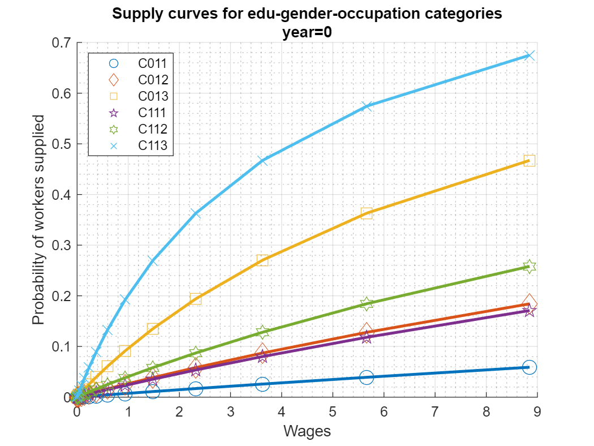
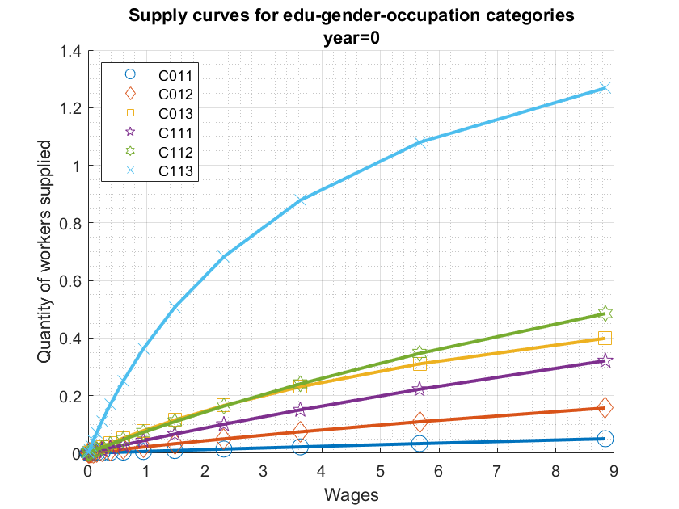
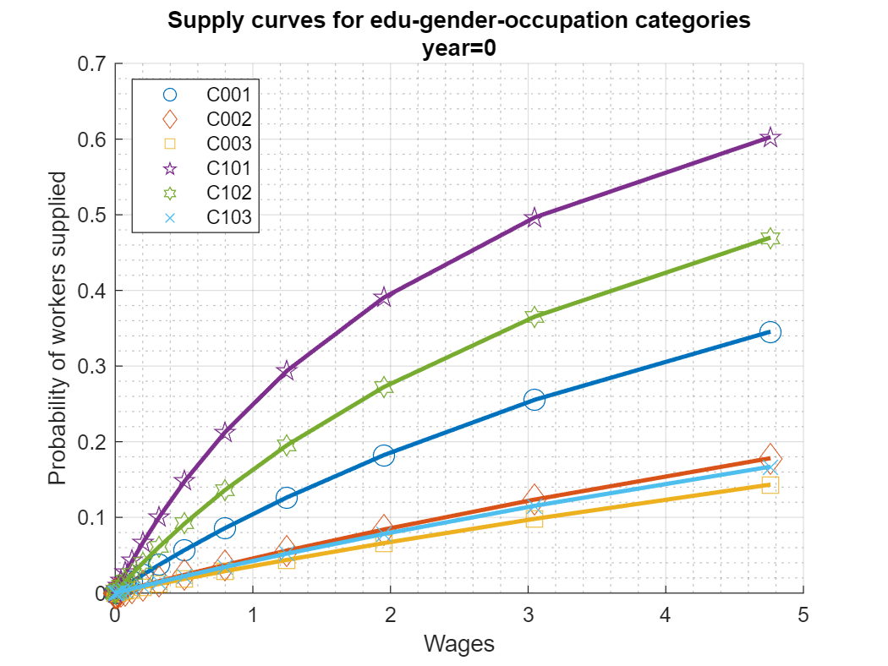
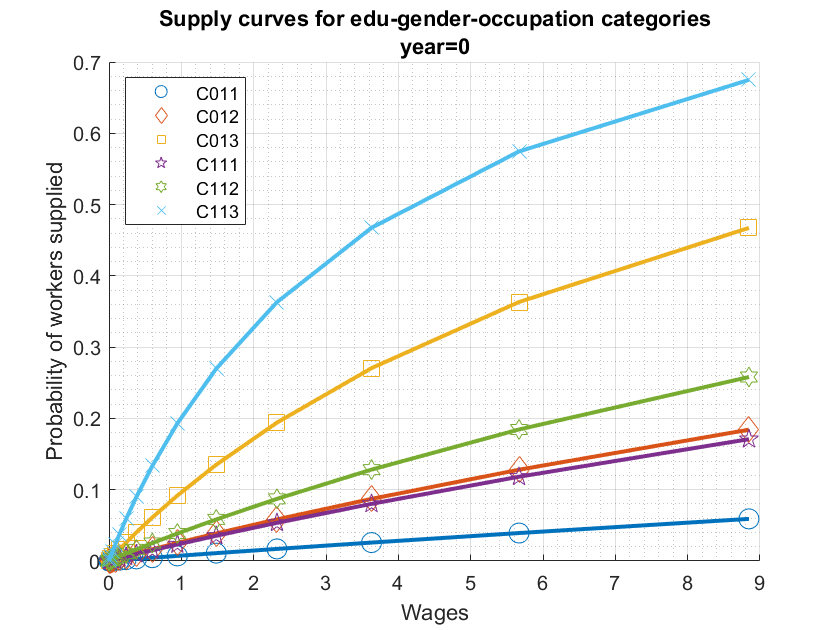
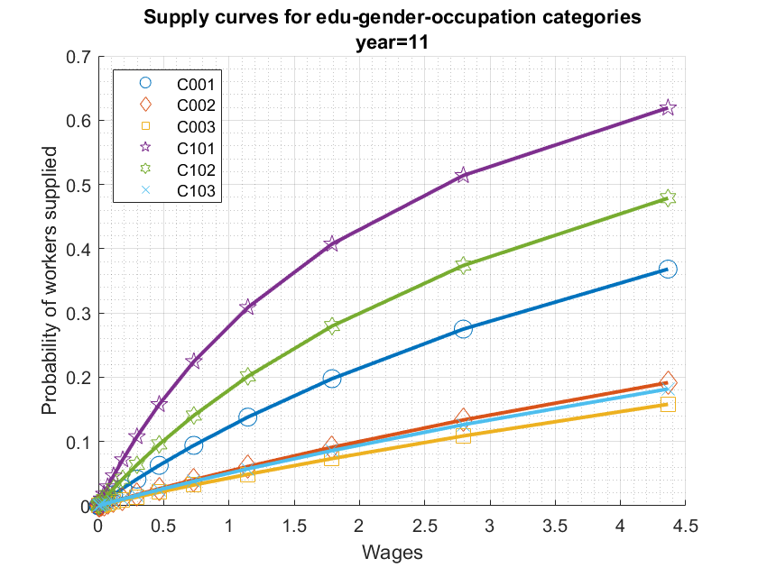
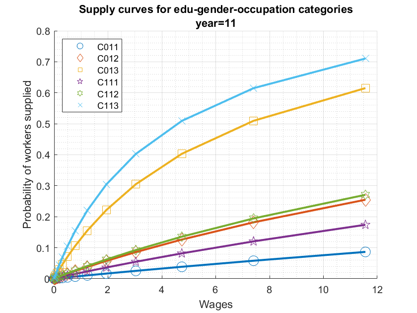
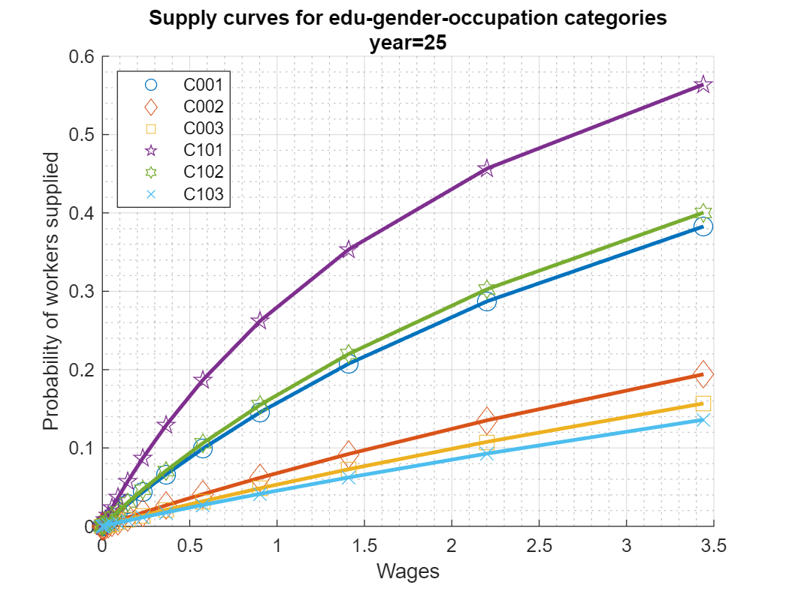
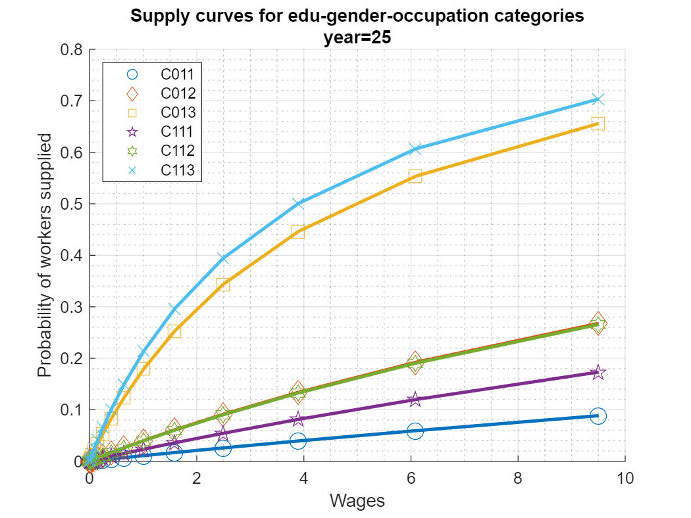

## bfw_mlogit

This is the example vignette for function: bfw_mlogit from the
[**PrjLabEquiBFW
Package**](https://fanwangecon.github.io/PrjLabEquiBFW/)**.**

### Default

    [mp_fl_labor_occprbty,mp_fl_labor_supplied] = bfw_mlogit();

    ----------------------------------------
    xxxxxxxxxxxxxxxxxxxxxxxxxxxxxxxxxxxxxxxx
    CONTAINER NAME: mp_wages Scalars
    xxxxxxxxxxxxxxxxxxxxxxxxxxxxxxxxxxxxxxxx
                i    idx    value 
                _    ___    ______

        C011    1     1     2.1604
        C012    2     2     5.6589
        C013    3     3     5.8023
        C111    4     4     4.5245
        C112    5     5     5.4146
        C113    6     6     8.0437

    BFW_SUPPLY_LEVELS_BF18;it_supplier_group=1;SNW_MP_CONTROL=;C011;time=;G01;fl_wage=2.1604
    Supply data;potwrker=0.85421;shrmarid=0.87768;shrufive=0.54077;applianc=0.95588;jobscrys=0.613
    BFW_SUPPLY_LEVELS_BF18;it_supplier_group=1;SNW_MP_CONTROL=;C012;time=;G01;fl_wage=5.6589
    Supply data;potwrker=0.85421;shrmarid=0.87768;shrufive=0.54077;applianc=0.95588;jobscrys=0.613
    BFW_SUPPLY_LEVELS_BF18;it_supplier_group=1;SNW_MP_CONTROL=;C013;time=;G01;fl_wage=5.8023
    Supply data;potwrker=0.85421;shrmarid=0.87768;shrufive=0.54077;applianc=0.95588;jobscrys=0.613
    BFW_SUPPLY_LEVELS_BF18;it_supplier_group=2;SNW_MP_CONTROL=;C111;time=;G11;fl_wage=4.5245
    Supply data;potwrker=1.8792;shrmarid=0.9391;shrufive=0.54027;applianc=0.93209;jobscrys=0.613
    BFW_SUPPLY_LEVELS_BF18;it_supplier_group=2;SNW_MP_CONTROL=;C112;time=;G11;fl_wage=5.4146
    Supply data;potwrker=1.8792;shrmarid=0.9391;shrufive=0.54027;applianc=0.93209;jobscrys=0.613
    BFW_SUPPLY_LEVELS_BF18;it_supplier_group=2;SNW_MP_CONTROL=;C113;time=;G11;fl_wage=8.0437
    Supply data;potwrker=1.8792;shrmarid=0.9391;shrufive=0.54027;applianc=0.93209;jobscrys=0.613
    ----------------------------------------
    xxxxxxxxxxxxxxxxxxxxxxxxxxxxxxxxxxxxxxxx
    CONTAINER NAME: mp_fl_labor_occprbty Scalars
    xxxxxxxxxxxxxxxxxxxxxxxxxxxxxxxxxxxxxxxx
                i    idx     value  
                _    ___    ________

        C011    1     1     0.015821
        C012    2     2      0.12787
        C013    3     3      0.36854
        C111    4     4     0.097357
        C112    5     5      0.17795
        C113    6     6      0.65443

    ----------------------------------------
    xxxxxxxxxxxxxxxxxxxxxxxxxxxxxxxxxxxxxxxx
    CONTAINER NAME: mp_fl_labor_supplied Scalars
    xxxxxxxxxxxxxxxxxxxxxxxxxxxxxxxxxxxxxxxx
                i    idx     value  
                _    ___    ________

        C011    1     1     0.013514
        C012    2     2      0.10923
        C013    3     3      0.31481
        C111    4     4      0.18296
        C112    5     5      0.33441
        C113    6     6       1.2298

    ----------------------------------------
    xxxxxxxxxxxxxxxxxxxxxxxxxxxxxxxxxxxxxxxx
    CONTAINER NAME: mp_fl_labor_supplied_3v0f Scalars
    xxxxxxxxxxxxxxxxxxxxxxxxxxxxxxxxxxxxxxxx
                i    idx     value  
                _    ___    ________

        C011    1     1     0.013514
        C012    2     2      0.10923
        C013    3     3      0.31481
        C111    4     4      0.18296
        C112    5     5      0.33441
        C113    6     6       1.2298

    ----------------------------------------
    xxxxxxxxxxxxxxxxxxxxxxxxxxxxxxxxxxxxxxxx
    CONTAINER NAME: mp_fc_labor_occprbty_3v0f Functions
    xxxxxxxxxxxxxxxxxxxxxxxxxxxxxxxxxxxxxxxx
                 i     idx                                       functionString                                   
                ___    ___    ____________________________________________________________________________________

        C011    "1"    "1"    "@(w1,w2,w3)fc_ar_prob_wrk(fl_psi0_manual,psi1,w1,fc_prob_denom_wage(w1,w2,w3))"    
        C012    "2"    "2"    "@(w1,w2,w3)fc_ar_prob_wrk(fl_psi0_routine,psi1,w2,fc_prob_denom_wage(w1,w2,w3))"   
        C013    "3"    "3"    "@(w1,w2,w3)fc_ar_prob_wrk(fl_psi0_analytical,psi1,w3,fc_prob_denom_wage(w1,w2,w3))"
        C111    "4"    "4"    "@(w1,w2,w3)fc_ar_prob_wrk(fl_psi0_manual,psi1,w1,fc_prob_denom_wage(w1,w2,w3))"    
        C112    "5"    "5"    "@(w1,w2,w3)fc_ar_prob_wrk(fl_psi0_routine,psi1,w2,fc_prob_denom_wage(w1,w2,w3))"   
        C113    "6"    "6"    "@(w1,w2,w3)fc_ar_prob_wrk(fl_psi0_analytical,psi1,w3,fc_prob_denom_wage(w1,w2,w3))"

    ----------------------------------------
    xxxxxxxxxxxxxxxxxxxxxxxxxxxxxxxxxxxxxxxx
    CONTAINER NAME: mp_fc_labor_supplied_3v0f Functions
    xxxxxxxxxxxxxxxxxxxxxxxxxxxxxxxxxxxxxxxx
                 i     idx                                    functionString                                
                ___    ___    ______________________________________________________________________________

        C011    "1"    "1"    "@(w1,w2,w3)fc_supply(fl_potwrklei_potwrker,fc_labor_occprbty_3v0f(w1,w2,w3))"
        C012    "2"    "2"    "@(w1,w2,w3)fc_supply(fl_potwrklei_potwrker,fc_labor_occprbty_3v0f(w1,w2,w3))"
        C013    "3"    "3"    "@(w1,w2,w3)fc_supply(fl_potwrklei_potwrker,fc_labor_occprbty_3v0f(w1,w2,w3))"
        C111    "4"    "4"    "@(w1,w2,w3)fc_supply(fl_potwrklei_potwrker,fc_labor_occprbty_3v0f(w1,w2,w3))"
        C112    "5"    "5"    "@(w1,w2,w3)fc_supply(fl_potwrklei_potwrker,fc_labor_occprbty_3v0f(w1,w2,w3))"
        C113    "6"    "6"    "@(w1,w2,w3)fc_supply(fl_potwrklei_potwrker,fc_labor_occprbty_3v0f(w1,w2,w3))"

    ----------------------------------------
    xxxxxxxxxxxxxxxxxxxxxxxxxxxxxxxxxxxxxxxx
    CONTAINER NAME: mp_fc_labor_occprbty_1v2f Functions
    xxxxxxxxxxxxxxxxxxxxxxxxxxxxxxxxxxxxxxxx
                 i     idx                                          functionString                                      
                ___    ___    __________________________________________________________________________________________

        C011    "1"    "1"    "@(wage)fc_ar_prob_wrk(fl_psi0_manual,psi1,wage,fc_prob_denom_wage(wage,fl_w2,fl_w3))"    
        C012    "2"    "2"    "@(wage)fc_ar_prob_wrk(fl_psi0_routine,psi1,wage,fc_prob_denom_wage(fl_w1,wage,fl_w3))"   
        C013    "3"    "3"    "@(wage)fc_ar_prob_wrk(fl_psi0_analytical,psi1,wage,fc_prob_denom_wage(fl_w1,fl_w2,wage))"
        C111    "4"    "4"    "@(wage)fc_ar_prob_wrk(fl_psi0_manual,psi1,wage,fc_prob_denom_wage(wage,fl_w2,fl_w3))"    
        C112    "5"    "5"    "@(wage)fc_ar_prob_wrk(fl_psi0_routine,psi1,wage,fc_prob_denom_wage(fl_w1,wage,fl_w3))"   
        C113    "6"    "6"    "@(wage)fc_ar_prob_wrk(fl_psi0_analytical,psi1,wage,fc_prob_denom_wage(fl_w1,fl_w2,wage))"

    ----------------------------------------
    xxxxxxxxxxxxxxxxxxxxxxxxxxxxxxxxxxxxxxxx
    CONTAINER NAME: mp_fc_labor_supplied_1v2f Functions
    xxxxxxxxxxxxxxxxxxxxxxxxxxxxxxxxxxxxxxxx
                 i     idx                                functionString                            
                ___    ___    ______________________________________________________________________

        C011    "1"    "1"    "@(wage)fc_supply(fl_potwrklei_potwrker,fc_labor_occprbty_1v2f(wage))"
        C012    "2"    "2"    "@(wage)fc_supply(fl_potwrklei_potwrker,fc_labor_occprbty_1v2f(wage))"
        C013    "3"    "3"    "@(wage)fc_supply(fl_potwrklei_potwrker,fc_labor_occprbty_1v2f(wage))"
        C111    "4"    "4"    "@(wage)fc_supply(fl_potwrklei_potwrker,fc_labor_occprbty_1v2f(wage))"
        C112    "5"    "5"    "@(wage)fc_supply(fl_potwrklei_potwrker,fc_labor_occprbty_1v2f(wage))"
        C113    "6"    "6"    "@(wage)fc_supply(fl_potwrklei_potwrker,fc_labor_occprbty_1v2f(wage))"

{width=500px}

{width=500px}

### Visualize Supply Curves Different Years

    % 1. Print and Graph options
    bl_verbose = false;
    bl_graph = true;
    ar_it_prob_or_quant = [1];

    % 2. Get Parameters and data
    bl_log_wage = true;
    bl_verbose_nest = false;
    % Get Parameters
    mp_params = bfw_mp_param_esti(bl_log_wage);
    mp_param_aux = bfw_mp_param_aux(bl_verbose_nest);
    mp_params = [mp_params ; mp_param_aux];
    % Get Data
    mp_data = bfw_mp_data(bl_verbose_nest);
    % Get Functions
    mp_func = bfw_mp_func_supply(bl_log_wage, bl_verbose_nest);
    % Get Controls
    mp_controls = bfw_mp_control();

    % 3. Data from which year, only integer year value allowed
    % ar_it_data_year = [1989 1994 2000 2008 2014];
    ar_it_data_year = [1989 2000 2014];
    for it_data_year=ar_it_data_year

        % 4. Which categories to obtain data from, there are 12 possible
        % For non-college equilibrium, six wages, three female, three males
        % gen_occ = gender occupation
        for bl_skilled = [false true]
            if (bl_skilled)
                mt_st_gen_occ_categories = [...
                    "C011", "C012", "C013"; ...
                    "C111", "C112", "C113"];
            else
                mt_st_gen_occ_categories = [...
                    "C001", "C002", "C003"; ...
                    "C101", "C102", "C103"];
            end
            
            % 5. Array of wages, at most, since there are six nests, there are 12
            % prices possible. And there are 12 quantity supplies possible, coming
            % from four tyeps of workers, each supply 3 + home categories.
            mp_wages = containers.Map('KeyType', 'char', 'ValueType', 'any');
            % Obtain some equilibrium wage data as testing inputs
            mp_path = bfw_mp_path();
            spt_codem_data = mp_path('spt_codem_data');
            tb_data_pq = mp_data('tb_data_pq');
            tb_data_pq = tb_data_pq(:, ["year", "category", "numberWorkers", "meanWage"]);
            ar_st_gen_occ_categories = mt_st_gen_occ_categories(:)';
            for st_gen_occ=ar_st_gen_occ_categories
                tb_gen_occ_over_years = tb_data_pq(strcmp(tb_data_pq.category, st_gen_occ),:);
                fl_wage_one_year = tb_gen_occ_over_years(tb_gen_occ_over_years.year == (it_data_year), :);
                mp_wages(st_gen_occ) = fl_wage_one_year{1, "meanWage"};
            end

            % Print Wages
            % ff_container_map_display(mp_wages);

            % Get date offset
            params_group = values(mp_data, {'date_esti_offset'});
            [date_esti_offset] = params_group{:};

            % Run function
            [mp_fl_labor_occprbty,mp_fl_labor_supplied] = bfw_mlogit(...
                mp_params, mp_data, mp_func, mp_controls, ...
                mt_st_gen_occ_categories, it_data_year - date_esti_offset, mp_wages, ...
                bl_verbose, bl_graph, ...
                ar_it_prob_or_quant);
        end
    end

{width=500px}

{width=500px}

{width=500px}

{width=500px}

{width=500px}

{width=500px}
